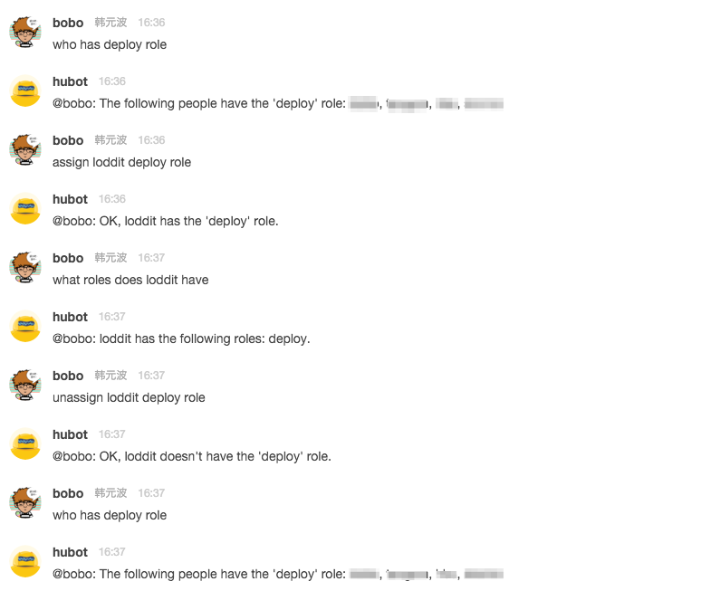

# Hubot 权限管理

### 安装步骤

 权限管理是参考 [hubot-auth](https://www.npmjs.com/package/hubot-auth) 进行的修改，安装过程:

 1. 按照 [hubot-auth](https://www.npmjs.com/package/hubot-auth) 说明的步骤进行安装
 2. 将 auth.coffee 覆盖 hubot-auth 下的代码
 3. 在 hubot 安装目录下的 external-scripts.json 文件中增加 hubot-auth

### 使用说明

 - hubot assign <user> <role> role - Assigns a role to a user
 - hubot unassign <user> <role> role - Removes a role from a user
 - hubot what roles does <user> have - Find out what roles a user has
 - hubot who has <role> role - Find out who has the given role

### 效果截图

