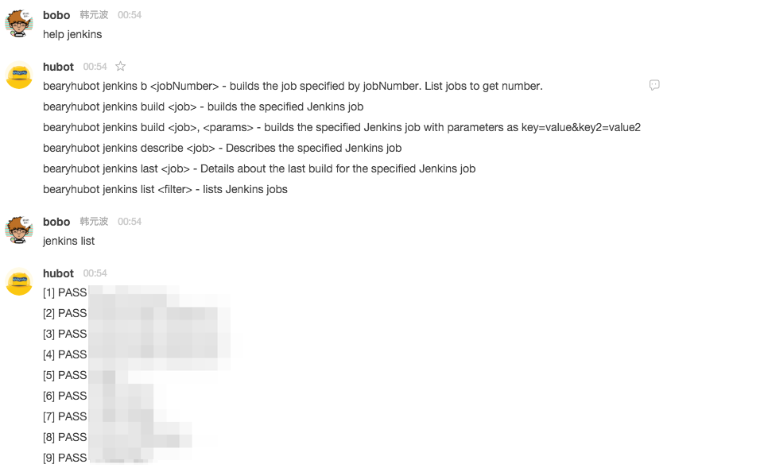

# Hubot Jenkins 部署服务

### 依赖
  - hubot-auth

### 安装步骤

 Jenkins 插件是参考 [hubot-jenkins](https://www.npmjs.com/package/hubot-jenkins) 进行的修改，安装过程:

 1. 按照 [hubot-jenkins](https://www.npmjs.com/package/hubot-jenkins) 说明的步骤进行安装
 2. 将 jenkins.coffee 覆盖 hubot-jenkins 下的代码
 3. 在 hubot 安装目录下的 external-scripts.json 文件中增加 hubot-jenkins

### 使用说明

 - hubot jenkins b <jobNumber> - builds the job specified by jobNumber. List jobs to get number.
 - hubot jenkins build <job> - builds the specified Jenkins job
 - hubot jenkins build <job>, <params> - builds the specified Jenkins job with parameters as key=value&key2=value2
 - hubot jenkins list <filter> - lists Jenkins jobs
 - hubot jenkins describe <job> - Describes the specified Jenkins job
 - hubot jenkins last <job> - Details about the last build for the specified Jenkins job

### 效果截图

