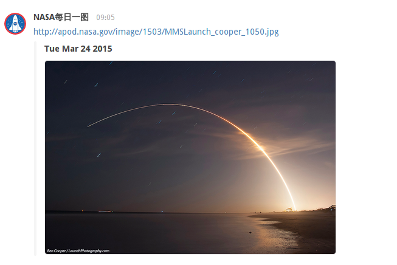

# NASA APOD #

来自 美国国家航空航天局 的每日一图，天文深受天文爱好者的喜欢

### 使用方式 ###
1. 在 BearyChat 里添加一个 incoming 机器人
2. 这个 incoming 机器人将带有一个Hook 地址，把它复制出来
3. 用复制的出来的地址替换 nasa.coffee 里的 YOUR_HOOK_URL 变量
4. 将 nasa.coffee 放到一个台长期运行的服务器上，比如你的 VPS。
5. 测试脚本能否正常运行， 服务器需要 node 环境 coffeescript 和几个脚本里使用的 package 如果没有请安装他们
6. 用 corntab -e 设置一个 cronjob，例如每天早上 9 点发送
  `0 9 * * *  coffee /home/deploy/loddit/nasa.coffee`

这样你每天就会在你设置的讨论组里收到这个精美 NASA 每日一图了。
