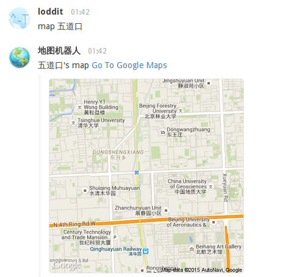

# Map #

地图机器人

### 部署方式 ###

这个 lua 脚本是在 webscript.io 这个云服务上运行的。
在 webscript.io 创建一个 script 把代码复制过去即可 。

地图数据是由 Google Maps 提供的 static map API http://www.google.cn/maps/api/staticmap

### 使用方式 ###
1. 在 BearyChat 里添加一个 outgoing 机器人
2. 填写好触发关键词比如「map」
3. 然后将你在 webscript.io 的脚本地址复制到机器人「POST请求地址」里
4. 保存这个机器人，这时你就可以回到聊天主界面输入 「map 五道口」 机器人就会立即回复你宇宙中心的地址
5. 如果搜索没有搜索结果，你就会获得一张世界地图

效果截图:

(现在 webscript.io 提供 7 天免费试用，如果你不想付费可以使用我部署的脚本 http://loddit.webscript.io/map 这个脚本会和这里的代码保持同步)
